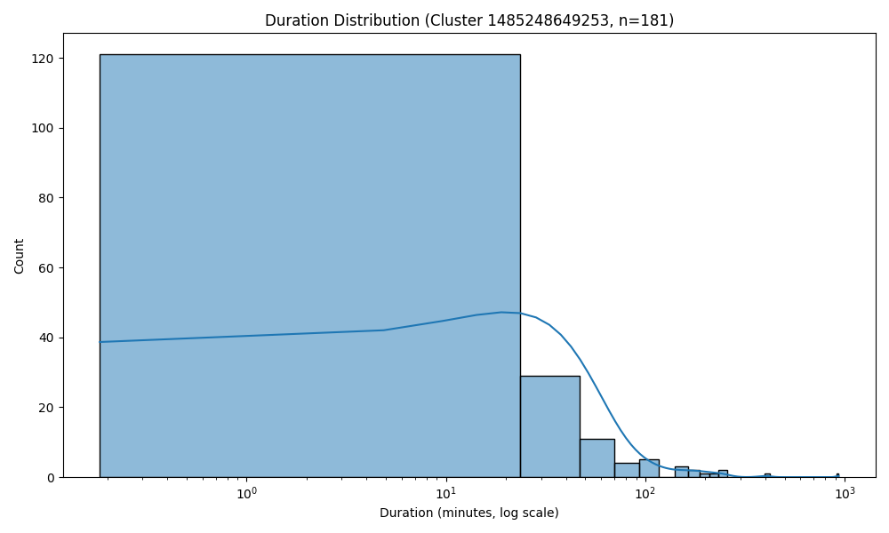

# ANALYSIS

## Dataset & Goals
You analyzed Spark/YARN container logs stored in S3.

**Objectives**
1. **Problem 1 – Log levels**
   - Count lines by level (INFO/WARN/ERROR/DEBUG)
   - Random sample of log lines
   - Human-readable summary

2. **Problem 2 – Cluster usage**
   - Per-application **timeline** (start/end)
   - **Per-cluster** summary (#apps, first/last activity)
   - Visuals for app counts and duration distribution

_All outputs referenced live under `data/output/`._

---

## Problem 1 — Log Levels

**Artifacts**
- `problem1_counts.csv`
- `problem1_sample.csv`
- `problem1_summary.txt`

**Headline numbers** (from `problem1_summary.txt`)
- Total log lines processed: **33,236,604**
- Lines with recognized levels: **27,410,336**
- Unique levels found: **3** (INFO, WARN, ERROR)

**Distribution**

| Level | Count     | Share  |
|------:|----------:|-------:|
| INFO  | 27,389,482| 99.92% |
| WARN  | 9,595     | 0.04%  |
| ERROR | 11,259    | 0.04%  |

**Interpretation**
- Logs are overwhelmingly **INFO**; WARN/ERROR combined are ~**0.08%**. Either the cluster is healthy or INFO verbosity is very high.
- Use `problem1_sample.csv` to spot-check emitters for noisy components and verify that WARN/ERRORs are benign.

**Possible extensions**
- Top components by WARN/ERROR counts
- Hour-of-day spike analysis
- Deduplication of repetitive stack traces

---

## Problem 2 — Cluster Usage & Timelines

**Artifacts**
- `problem2_timeline.csv`
- `problem2_cluster_summary.csv`
- `problem2_stats.txt`
- `problem2_bar_chart.png`
- `problem2_density_plot.png`

**Statistics** (from `problem2_stats.txt`)
- **Total unique clusters:** **6**
- **Total applications:** **194**
- **Average apps/cluster:** **32.33**

**Per-cluster load** (from `problem2_cluster_summary.csv`)
- **Cluster `1485248649253`** dominates with **181 apps**  
  - Window: **2017-01-24 17:00:28 → 2017-07-27 21:45:00**
- Lighter clusters:
  - `1472621869829`: 8 apps (2016-09-09, same-day window)
  - `1448006111297`: 2 apps (2016-04-07)
  - `1474351042505`: 1 app (2016-11-18 → 11-19)
  - `1440487435730`: 1 app (2015-09-01)
  - `1460011102909`: 1 app (2016-07-26)

**Visuals**

